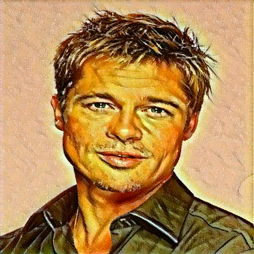

# Neural Style Transfer

This is a PyTorch implementation of [A Neural Algorithm of Artistic Style](https://arxiv.org/abs/1508.06576).




## Usage
```
./run_default.sh
```

For a full list of arguments, run:
```
python main.py --help
```